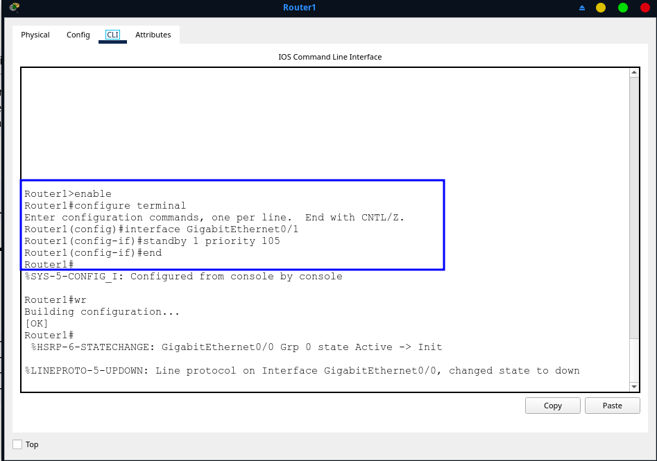
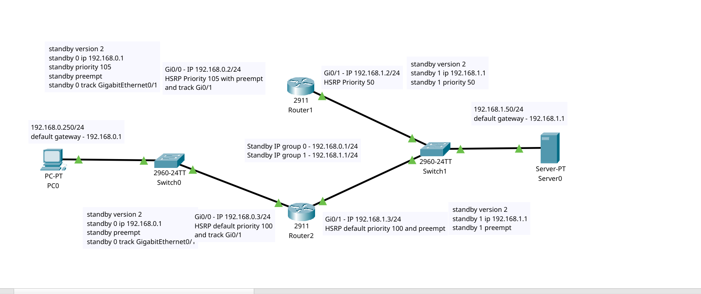
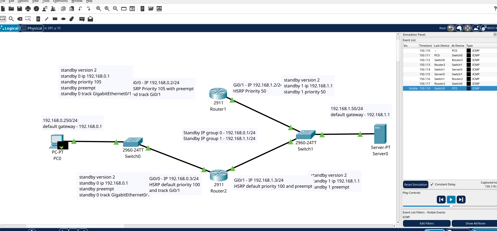
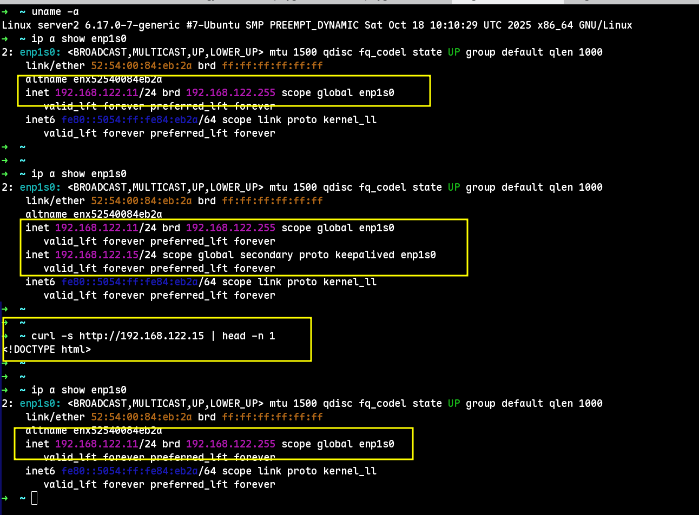

# Домашнее задание к занятию 1 «Disaster recovery и Keepalived»  
**Шаров Олег**

---

Задание 1  
Настроено отслеживание интерфейса GigabitEthernet0/0 для HSRP-группы 1 на обоих маршрутизаторах. Приоритет MASTER (Router1) — 105, BACKUP (Router2) — 100. Включён режим preempt. После разрыва кабеля между Router1 и Switch0 на интерфейсе Gi0/0 роль Active переключается на Router2, и связь между PC0 (192.168.0.250) и Server0 (192.168.1.50) сохраняется без прерываний.

1. Открыта схема в Cisco Packet Tracer.  
2. На Router1 и Router2 добавлена конфигурация HSRP-группы 1 на интерфейсе Gi0/0.  
3. Настроено отслеживание состояния интерфейса с помощью команды standby 1 track GigabitEthernet0/0 decrement 20.  
4. Выполнен тест: разрыв кабеля между Router1 и Switch0 на порту Gi0/0.  
5. Подтверждена непрерывность ping между PC0 и Server0.

6. Сохранена схема как homework1.pkt.  
7. Сделаны скриншоты: подключение Router1 к Switch0, CLI-настройка, схема после разрыва кабеля.

Поле для вставки кода...  
```bash
interface GigabitEthernet0/0
 standby 1 ip 192.168.0.1
 standby 1 priority 105
 standby 1 preempt
```





Задание 2
На двух виртуальных машинах Ubuntu установлены Keepalived и nginx. Написан bash-скрипт для проверки доступности веб-сервера (порт 80) и наличия файла index.html. Keepalived настроен на запуск этого скрипта каждые 3 секунды. При недоступности порта или отсутствии index.html плавающий IP 192.168.122.15 переключается на резервный сервер.


1.Запущены две ВМ Ubuntu Server в одной подсети (192.168.122.0/24).
2.Установлены nginx и keepalived на обеих ВМ.
3.Создан bash-скрипт /usr/local/bin/check_nginx.sh с правами на выполнение.
4.Настроен keepalived.conf с использованием vrrp_script.
5.Выполнена проверка: удалён index.html → IP переключился на BACKUP.
6. Вернул index.html → IP вернулся на MASTER (благодаря preempt).
7. Сделан скриншот с демонстрацией переключения IP.

```bash
#!/bin/bash
# /usr/local/bin/check_nginx.sh
if ! ss -tuln | grep -q ':80\b'; then
  exit 1
fi
if [ ! -f "/var/www/html/index.html" ]; then
  exit 1
fi
exit 0
```

```bash
# /etc/keepalived/keepalived.conf (MASTER)
vrrp_script chk_nginx {
  script "/usr/local/bin/check_nginx.sh"
  interval 3
  fall 2
  rise 2
}
vrrp_instance VI_1 {
  state MASTER
  interface enp1s0
  virtual_router_id 15
  priority 255
  advert_int 1
  preempt
  virtual_ipaddress {
    192.168.122.15/24
  }
  track_script {
    chk_nginx
  }
}
```

```bash
# /etc/keepalived/keepalived.conf (BACKUP)
vrrp_script chk_nginx {
  script "/usr/local/bin/check_nginx.sh"
  interval 3
  fall 2
  rise 2
}
vrrp_instance VI_1 {
  state BACKUP
  interface enp1s0
  virtual_router_id 15
  priority 100
  advert_int 1
  preempt
  virtual_ipaddress {
    192.168.122.15/24
  }
  track_script {
    chk_nginx
  }
}
```




